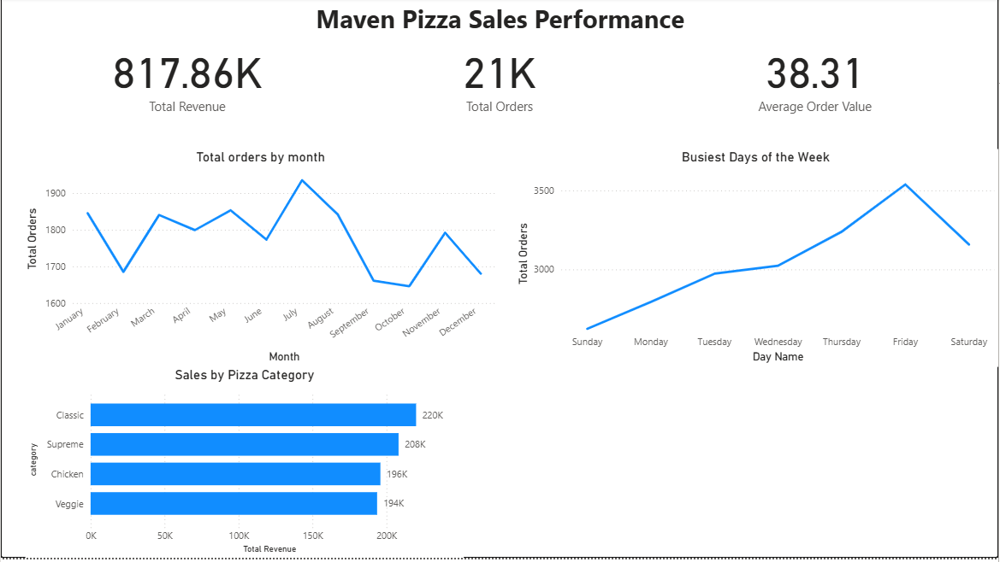

# 🍕 Maven Pizza Sales Analysis (Power BI)

### 📊 Project Overview
**Role:** Business Intelligence Analyst  
**Tools:** Microsoft Power BI, Power Query, DAX  
**Dataset:** Maven Pizza Place (4 CSV files: Orders, Order Details, Pizzas, Pizza Types)

### 💼 The Business Problem
The owner of "Maven Pizza," a local restaurant, was making decisions based on "gut feeling" rather than data. They needed a data-driven way to answer three critical questions:
1.  **Staffing:** When are the busiest days and times?
2.  **Inventory:** Which pizzas are best-selling, and which are underperforming?
3.  **Performance:** Is the business growing or shrinking this year?

### 💡 The Solution
I developed an end-to-end Business Intelligence solution using Power BI. The final deliverable is a dynamic, interactive dashboard that allows the owner to filter performance by month, day, and pizza category.



### 🛠️ Technical Steps

#### 1. Data Architecture (Star Schema)
I transformed four flat CSV files into a robust **Star Schema** data model to optimize performance and accurate filtering.
* **Fact Table:** `order_details` (Transactional data)
* **Dimension Tables:** `orders` (Time data), `pizzas` (Product data)


#### 2. ETL & Data Cleaning (Power Query)
Using Power Query, I performed advanced transformations:
* **Merged Queries:** Combined `pizzas` and `pizza_types` tables to create a unified Product Dimension.
* **Data Typing:** Validated data types (Time, Date, Currency) to prevent calculation errors.
* **Custom Columns:** Created a `Day Name` column and a conditional `Day Sort` column to ensure chronological sorting in visuals (Mon-Sun).

#### 3. DAX Calculations
I used DAX (Data Analysis Expressions) to calculate core KPIs.
* *Example Logic:* I used `SUMX` and `RELATED` to calculate revenue, as Quantity and Price were in separate tables.

```dax
Total Revenue = SUMX(order_details, order_details[quantity] * RELATED(pizzas[price]))
```

### 📈 Key Insights
Based on the analysis, I presented the following recommendations to the owner:

* **Operational Efficiency:** Sundays are the slowest days. I recommend reducing staff hours on Sundays to cut costs.

* **Inventory Management:** The "Classic" category drives the most revenue, while "Veggie" pizzas are the worst performers. The owner should consider reducing the Veggie menu options to minimize food waste.

* **Trend Analysis:** Sales peaked in July but have been trending downward since August. A "Holiday Special" promotion is recommended to reverse the Q4 slump.
